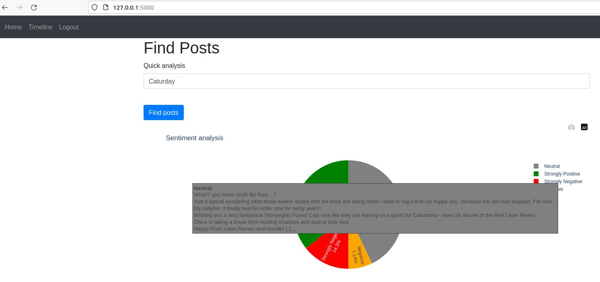

<div align="center">
  <h1>🌟 Sentiment Analyser 🌟</h1>
  <p><em>A tool to analyse sentiment of Mastodon posts based on #hashtag</em></p>
  
</div>

---

## 📋 Table of Contents
- [Overview](#overview)
- [Features](#features)
- [Installation](#installation)
- [Usage](#usage)
- [Examples](#examples)
- [License](#license)

---

## 📝 Overview

<p>
A tool designed to search posts by hashtag on Mastodon and analyze their sentiment. It fetches relevant posts, determines the sentiment of each (positive, neutral, or negative), and generates insightful charts to visualize the overall mood. Perfect for tracking brand sentiment, monitoring trending topics, or gaining insights into public opinion on Mastodon!
</p>

---

## 🚀 Features

- **Sign up**: Users need to create an account to access app features.
- **Log in**: Users can log in to their account.
- **Quick Search**: Users can search posts by #hashtag and obtain quick analysis of recent posts sentiment displayed as a pie chart.
- **Timeline**: Users can view how sentiment changed over time for the #hashtag based on their past searches displayed as a linechart.

---

## 🔧 Installation

### Prerequisites

1. **Python 3.x**: Make sure Python is installed. [Download Python](https://www.python.org/downloads/).
2. **Mastodon account**: Create a free account to access Mastodon API.

### Step-by-Step Guide


# Clone the repository
```
git clone https://github.com/janstawowy/analysis_web.git
```
```
cd analysis_web
```
# (Optional) Create and activate a virtual environment
```
python3 -m venv venv
```
```
source venv/bin/activate
```
# Install dependencies
```
pip install -r requirements.txt
```

## 💻 Usage

    Set Up Keys Variables: Create a .json file in the keys directory with necessary keys.

    {
    "client_id": <YOUR MASTODON CLIENT ID>,
    "client_secret": <YOUR MASTODON CLIENT SECRET>,
    "access_token": <YOUR MASTODON ACCESS TOKEN>,
    "api_base_url":<URL OF MASTODON CHANNEL>,
    "flask_secret": <YOUR FLASK SECRET>

}

Run the Application


```
    python main.py
```
Access the Application on your localhost
```
    http://127.0.0.1:5000
```

## 🔍 Examples
Login Page

Search by #Hashtag

SearchTimeline


## 📜 License

This project is licensed under the MIT License 
Permission is hereby granted, free of charge, to any person obtaining a copy of this software and associated documentation files (the “Software”), to deal in the Software without restriction, including without limitation the rights to use, copy, modify, merge, publish, distribute, sublicense, and/or sell copies of the Software, and to permit persons to whom the Software is furnished to do so, subject to the following conditions:

The above copyright notice and this permission notice shall be included in all copies or substantial portions of the Software.

THE SOFTWARE IS PROVIDED “AS IS”, WITHOUT WARRANTY OF ANY KIND, EXPRESS OR IMPLIED, INCLUDING BUT NOT LIMITED TO THE WARRANTIES OF MERCHANTABILITY, FITNESS FOR A PARTICULAR PURPOSE AND NONINFRINGEMENT. IN NO EVENT SHALL THE AUTHORS OR COPYRIGHT HOLDERS BE LIABLE FOR ANY CLAIM, DAMAGES OR OTHER LIABILITY, WHETHER IN AN ACTION OF CONTRACT, TORT OR OTHERWISE, ARISING FROM, OUT OF OR IN CONNECTION WITH THE SOFTWARE OR THE USE OR OTHER DEALINGS IN THE SOFTWARE.
